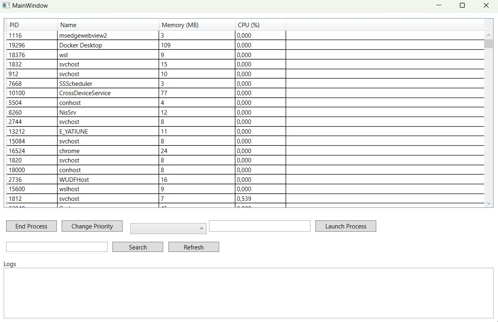
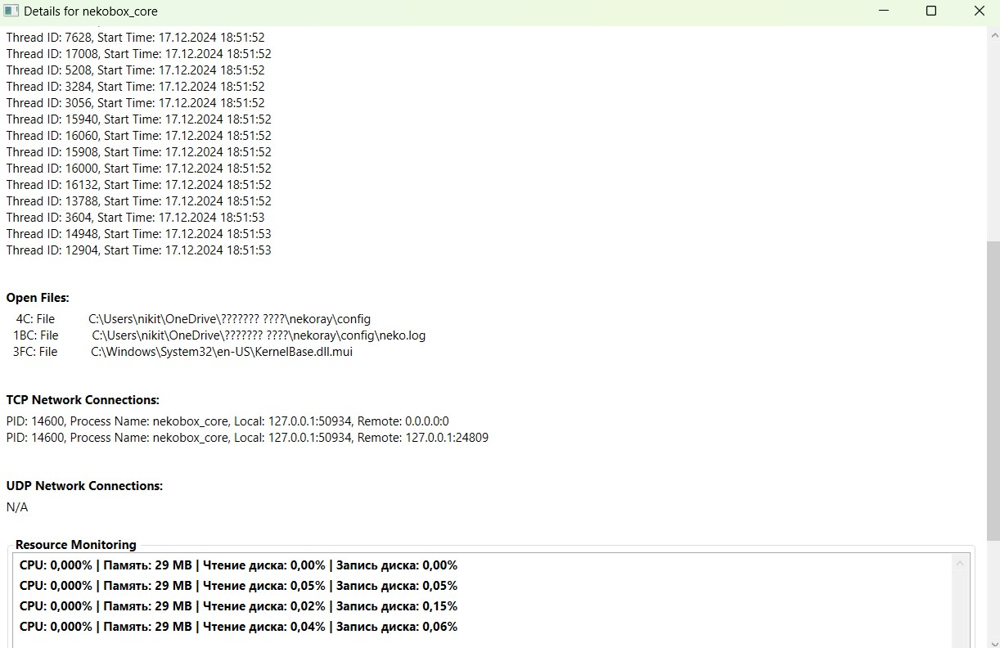
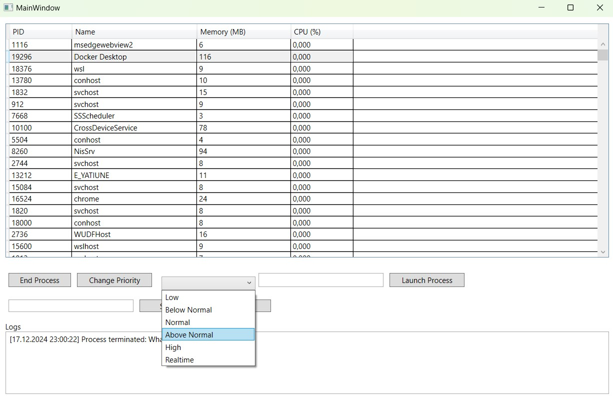
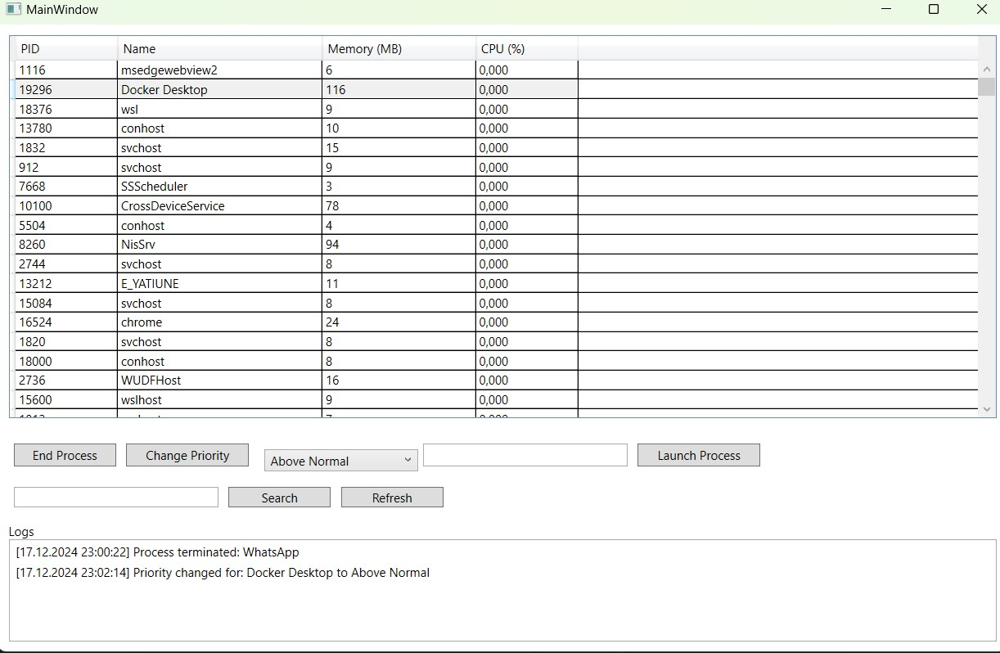
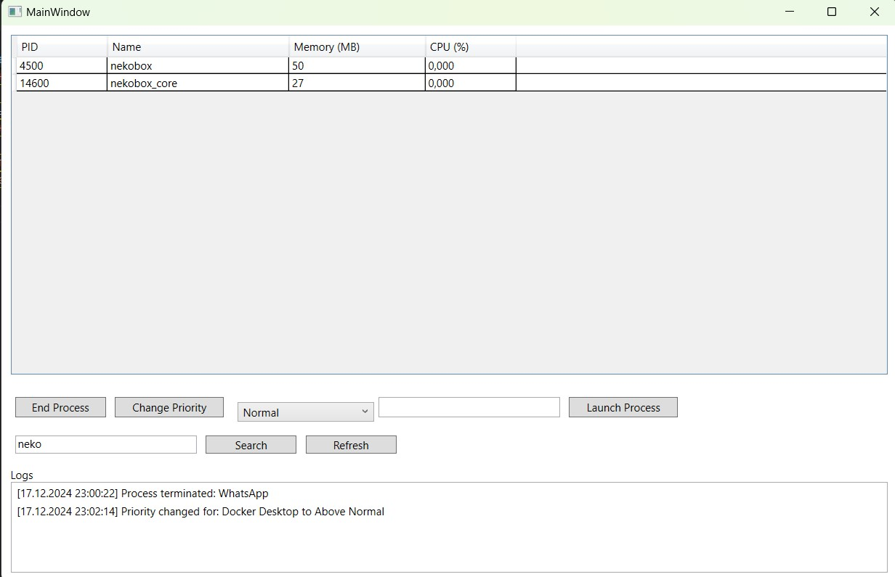
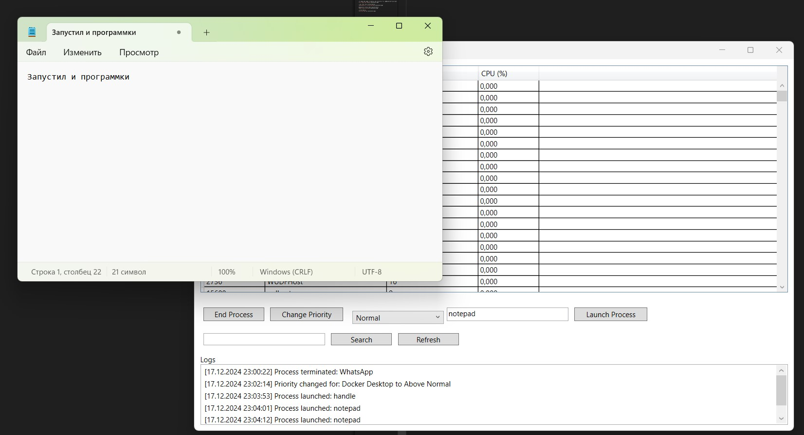

# Система управления задачами 
Функционал системы:

1. Отслеживать текущие процессы (отображаются: ИД процесса, использование CPU и памяти)
2. Возможность завершения выбранного процесса
3. Возможность изменения приоритета процесса
4. Отображение подробной информации о каждом процессе 
5. Поиск процесса по имени или идентификатору
6. Мониторинг ресурсов для выбранного процесса в реальном времени
7. Логирование завершенных процессов и изменений приоритетов
8. Возможность запуска нового процесса из интерфейса

Главное окно системы:

Подробная информация о процессе, где можно посмотреть запущенные потоки процесса, открытые файлы,установленные TCP и UDP соединения и Мониторинг ресурсов процесса

Пример выборы приоритета процесса:

Измение приоритета и завершение процесса:

Поиск процесса:

Запуск процесса:
